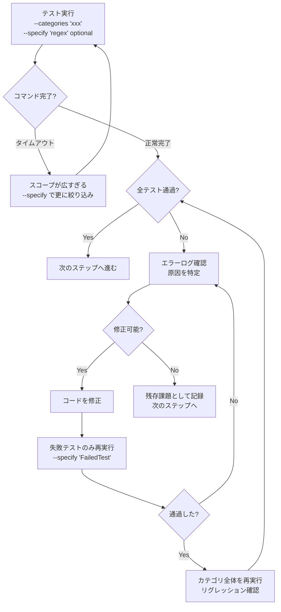

# Run All Tests

全てのビルドとテスト（単体テスト・統合テスト・E2E）を実行し、
失敗があれば原因を調査して修正し、再度テストするループを回す。

`integration_test.sh` は全カテゴリを一括実行すると非常に長時間かかるため、
**選択的実行プラン**を立ててカテゴリ単位で分割実行する。

---

## Phase 0: 前提条件の確認

1. コンテナ環境が起動していることを確認する。未起動なら先にセットアップする。
   ```bash
   ./scripts/setup/setup_containers.sh
   ```

## Phase 1: Full Build & Unit Test

プロジェクト全体のビルドと単体テストを実行する。
統合テストは最新のビルド成果物に対して行う必要があるため、**必ずこのフェーズを先に通す**。

```bash
./scripts/process/build.sh
```

- 失敗した場合 → エラーログを確認し、原因を特定して修正 → `build.sh` を再実行
- 全て通過するまでこのフェーズを繰り返す

> **Tip**: バックエンドのみ高速に確認したい場合は `--skip-frontend --skip-etc` も利用可能。

## Phase 2: 選択的実行プランの作成

カテゴリは将来追加される可能性があるため、**決め打ちせず毎回動的に発見する**。

### 2.1 利用可能なカテゴリの発見

以下の手順で現在利用可能なカテゴリを特定する:

1. **ヘルプ出力を確認**:
   ```bash
   ./scripts/process/integration_test.sh --help
   ```
   `Available categories:` の行からカテゴリ一覧を取得する。

2. **バックエンドテストディレクトリを走査**:
   ```bash
   ls -d features/backend/tests/*/
   ```
   `testdata` などテスト実行対象外のディレクトリを除外し、
   実際にテストコードが存在するディレクトリをカテゴリとして扱う。

3. **フロントエンド（GUI）テストの有無を確認**:
   `features/frontend/scripts/integration_test.sh` が存在すれば `gui` カテゴリも対象。

4. **カテゴリ実行順序の確認**:
   `features/backend/scripts/integration_test.sh` 内の `GO_CATEGORY_ORDER` 配列から
   バックエンドカテゴリの推奨実行順序を取得する。

> **重要**: ヘルプ出力やディレクトリ構造から得た情報が信頼できる情報源となる。
> スキルファイルに記載されたカテゴリ名ではなく、常にこの動的発見の結果を使用すること。

### 2.2 テストファイルの調査

発見したカテゴリごとにテストファイルの概要を把握する:
- **Backend**: `features/backend/tests/{category}/` 配下のテストファイル
- **GUI**: `features/frontend/extension/e2e/scenarios/` 配下のテストファイル

### 2.3 実行プランの策定

1. 発見した全カテゴリについて実行順序を決定する。
2. 各カテゴリについて、テストケースが多い場合は `--specify` で正規表現フィルタを使い分割する。

プランのフォーマット例（カテゴリは動的に発見されたものを使用）:

```
実行プラン:
1. {category_a} : --categories "{category_a}"
2. {category_b} : --categories "{category_b}"
...
N. gui          : --categories "gui"
```

必要に応じて、カテゴリ内を `--specify` で更に分割する:

```
実行プラン (分割版):
1-a. {category_a} (前半): --categories "{category_a}" --specify "TestXxx.*"
1-b. {category_a} (後半): --categories "{category_a}" --specify "TestYyy.*"
...
```

> **Note**: プランは柔軟に調整してよい。テストの量や過去の失敗傾向に応じて分割粒度を変える。

## Phase 3: 選択的実行ループ

プランに沿って、各ステップを順番に実行する。

### 各ステップの実行フロー



### タイムアウト時の分割戦略

テスト実行がコマンドのタイムアウト時間内に完了しない場合、実行スコープが広すぎる。
`--specify` で正規表現フィルタを追加し、対象テストを絞り込んで再実行する。

1. **タイムアウト発生**: カテゴリ全体の実行が時間内に完了しない。
2. **テストケースの列挙**: そのカテゴリのテストファイルを調査し、テスト関数名を把握する。
3. **分割実行**: `--specify` でテスト名の正規表現パターンを指定し、小さな単位で実行する。
4. **プランの更新**: 該当カテゴリのプランを分割版に差し替え、以降は分割単位で進める。

```bash
# タイムアウトした場合の分割例
# Before (スコープが広すぎてタイムアウト):
./scripts/process/integration_test.sh --categories "taskengine"

# After (テスト名で分割して個別実行):
./scripts/process/integration_test.sh --categories "taskengine" --specify "TestCreate.*"
./scripts/process/integration_test.sh --categories "taskengine" --specify "TestUpdate.*"
./scripts/process/integration_test.sh --categories "taskengine" --specify "TestDelete.*"
```

### 実行コマンド例

```bash
# カテゴリ指定で実行
./scripts/process/integration_test.sh --categories "common"

# カテゴリ＋正規表現フィルタで実行
./scripts/process/integration_test.sh --categories "taskengine" --specify "TestCreate.*"

# 失敗テストを修正後、そのテストだけ再実行
./scripts/process/integration_test.sh --categories "taskengine" --specify "TestCreateTask_InvalidInput"
```

### 修正時の注意事項

- 修正はできるだけ最小限にとどめる。
- 実装コードの修正とテストコードの修正を区別して記録する。
- 修正完了時には `git add` → `git commit` で修正内容をこまめにコミットする。コミットは目的や意味のある単位で行う。
- 修正後は、まず**失敗したテストのみ**を `--specify` で再実行する。
- 失敗テストが通過したら、**そのカテゴリ全体**を再実行してリグレッションがないか確認する。
  カテゴリ全体でもタイムアウトする場合は、分割単位でそれぞれ通過を確認すればよい。

## Phase 4: 最終確認

全てのカテゴリのテストが通過したら、最後に全体を通しで再確認する。
Phase 2 で発見した全カテゴリを、プランと同じ順序で1つずつ実行する。

```bash
# 各カテゴリを順番に実行（Phase 2 で発見した順序に従う）
./scripts/process/integration_test.sh --categories "{category}"
# ... 全カテゴリについて繰り返す
```

> **判断**: Phase 3 で修正が一切なかった場合、Phase 4 はスキップしてもよい。
> 修正があった場合は、リグレッション確認のため Phase 4 を必ず実施する。

## Phase 5: 結果レポート

全フェーズ完了後、以下のサマリーをユーザーに報告する:

- **ビルド結果**: 成功 / 失敗回数
- **テスト結果**: カテゴリごとの成功 / 失敗テスト数
- **修正内容**: 修正したファイルと変更の概要
- **残存課題**: 解決できなかった問題がある場合はその詳細

### Git Push

全てのテストが成功した場合、`git push` を実施してリモートリポジトリに反映する。
テストが失敗している状態ではプッシュしない。

```bash
git push
```

---

## 長時間実行への対応

各スクリプトは実行に時間がかかる場合がある。以下のガイドラインに従う:

- **`build.sh`**: 通常は比較的短時間で完了する。デフォルトのタイムアウトで実行する。
- **`integration_test.sh`**: カテゴリ分割しても長時間かかる場合がある。
  - `block_until_ms` を十分大きく設定する（推奨: 300000ms 以上）。
  - 完了を待てない場合はバックグラウンド実行（`block_until_ms: 0`）に切り替え、
    Await ツールで定期的にポーリングする。
  - 出力ログの末尾を監視して進捗を確認する。
  - **それでもタイムアウトする場合**: `--specify` で正規表現フィルタを追加して
    実行対象を更に絞り込む。Phase 3 の「タイムアウト時の分割戦略」に従う。
