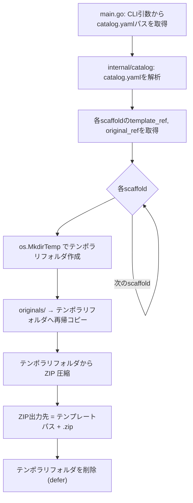

# Templatizer: テンポラリフォルダを介した ZIP 圧縮への変更

## 背景 (Background)

現在の templatizer は、`catalog/originals/` ディレクトリから直接 `catalog/templates/` に向けて ZIP ファイルを生成する処理フローになっている。

```
originals/ → (ZIP圧縮) → templates/*.zip
```

今後、ZIP 圧縮前にファイル操作（テンプレート変数の埋め込み、ファイルの追加・削除・修正など）を行うニーズがある。しかし、`originals/` フォルダ内のファイルを直接変更してしまうと、元ファイルが汚染され復元が困難になる。

そのため、以下のフローに変更することで、オリジナルファイルの安全性を確保しつつ、ZIP 圧縮前のファイル操作を可能にする準備を整えたい。

```
originals/ → (再帰コピー) → temp/ → (ZIP圧縮) → templates/*.zip
```

現段階では「テンポラリフォルダへのコピー＋そこからの圧縮」のみを実装し、ファイル操作の処理は将来の仕様で追加する。

## 要件 (Requirements)

### 必須要件

1. **テンポラリフォルダの作成**
   - 各 scaffold の処理開始時に、OS のテンポラリディレクトリ配下にワークディレクトリを作成する
   - Go 標準ライブラリの `os.MkdirTemp` を使用する

2. **originals からテンポラリフォルダへの再帰コピー**
   - `original_ref` で示されるディレクトリの全内容をテンポラリフォルダへ再帰的にコピーする
   - ファイル、サブディレクトリ、ネストされた構造をすべて保持する
   - ファイルの内容・パーミッション（可能な範囲で）を維持する

3. **テンポラリフォルダから ZIP を生成**
   - 既存の `archiver.ZipDirectory` をそのまま利用し、ソースディレクトリをテンポラリフォルダに変更する
   - ZIP ファイルの出力先は従来どおり `template_ref + ".zip"`

4. **テンポラリフォルダのクリーンアップ**
   - 各 scaffold の処理完了後（成功・失敗問わず）、テンポラリフォルダを `os.RemoveAll` で削除する
   - defer を使用して確実にクリーンアップされるようにする

5. **originals フォルダの保護**
   - 処理の過程で `originals/` フォルダの内容が一切変更されないこと

### 任意要件

- テンポラリフォルダの作成・コピー・削除に関するログを出力する
- 将来的にテンポラリフォルダ上でファイル操作を差し込めるよう、処理フローに拡張ポイントを意識する

## 実現方針 (Implementation Approach)

### 処理フロー変更



### コード変更箇所

#### `main.go` の変更

現在の処理:
```go
originalDir := filepath.Join(baseDir, s.OriginalRef)
zipPath := filepath.Join(baseDir, s.TemplateRef+".zip")
archiver.ZipDirectory(originalDir, zipPath)
```

変更後の処理:
```go
originalDir := filepath.Join(baseDir, s.OriginalRef)
zipPath := filepath.Join(baseDir, s.TemplateRef+".zip")

// 1. テンポラリフォルダ作成
tempDir, err := os.MkdirTemp("", "templatizer-*")
defer os.RemoveAll(tempDir)

// 2. originals → テンポラリフォルダへ再帰コピー
copier.CopyDir(originalDir, tempDir)

// 3. テンポラリから ZIP 圧縮
archiver.ZipDirectory(tempDir, zipPath)
```

#### 新規モジュール: `internal/copier/`

```
features/templatizer/
└── internal/
    ├── archiver/        # 既存（変更なし）
    ├── catalog/         # 既存（変更なし）
    └── copier/          # 新規
        ├── copier.go    # ディレクトリの再帰コピーロジック
        └── copier_test.go # コピーのテスト
```

- `copier.CopyDir(srcDir, destDir string) error`: `srcDir` の内容を `destDir` に再帰的にコピーする関数
  - `filepath.WalkDir` で `srcDir` を走査
  - ファイルの場合: `io.Copy` でコピー
  - ディレクトリの場合: `os.MkdirAll` で対応するディレクトリを作成
  - コピー元の相対パスを維持

### 既存コンポーネントへの影響

| コンポーネント | 変更有無 | 内容 |
|---|---|---|
| `internal/archiver/` | 変更なし | ZIP 圧縮ロジックはそのまま利用 |
| `internal/catalog/` | 変更なし | catalog.yaml 解析ロジックはそのまま利用 |
| `internal/copier/` | **新規追加** | ディレクトリ再帰コピーの関数 |
| `main.go` | **変更** | テンポラリフォルダの作成・コピー・削除フローの追加 |

## 検証シナリオ (Verification Scenarios)

1. templatizer を実行すると、以下の順序で処理が行われること:
   (1) テンポラリフォルダが作成される
   (2) `originals/` の内容がテンポラリフォルダへコピーされる
   (3) テンポラリフォルダから ZIP が生成される
   (4) テンポラリフォルダが削除される

2. 生成された ZIP ファイルを展開すると、元の `originals/` ディレクトリと同一の内容であること
   - ファイル名、ディレクトリ構造、ファイル内容が完全に一致

3. 処理完了後、`originals/` フォルダの内容が一切変更されていないこと
   - ファイルの追加・削除・変更がないことを確認

4. テンポラリフォルダが処理完了後に確実に削除されていること

5. scaffold が3つある場合、3つすべてについて上記フローが正しく実行されること

6. エラーケース: `originals/` ディレクトリが存在しない場合、適切なエラーメッセージが出力されること

## テスト項目 (Testing for the Requirements)

### 単体テスト

| テスト対象 | テスト内容 | テストファイル |
|---|---|---|
| ディレクトリ再帰コピー | src のファイル・サブディレクトリが dest に正しくコピーされること | `internal/copier/copier_test.go` |
| ディレクトリ再帰コピー | ネストされたディレクトリ構造が保持されること | `internal/copier/copier_test.go` |
| ディレクトリ再帰コピー | コピー元ディレクトリが存在しない場合にエラーを返すこと | `internal/copier/copier_test.go` |
| ディレクトリ再帰コピー | コピー後、コピー元のファイルが変更されていないこと | `internal/copier/copier_test.go` |
| ZIP 圧縮 (既存) | 既存テストがそのまま通ること（リグレッション確認） | `internal/archiver/archiver_test.go` |

### 検証コマンド

```bash
# 全体ビルド・単体テスト
scripts/process/build.sh

# templatizer 単体テストのみ
cd features/templatizer && go test ./...
```
