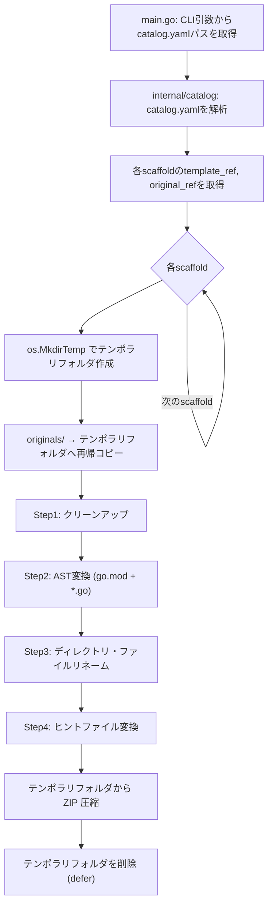

# Templatizer: 動的プログラムベース・テンプレート変換システム

## 背景 (Background)

前仕様 (`000-Templatizer-TempFolder.md`) により、templatizer は `originals/` → テンポラリフォルダ → ZIP 圧縮 というフローを実現した。テンポラリフォルダ上でのファイル操作が可能になったことで、次のステップとして**テンプレート変換処理**の実装が求められている。

### 現在の課題

従来のテンプレート化手法（プレースホルダー構文の埋め込み）には以下の問題がある：

1. **生成AIとの相性が悪い** — AI に未知のテンプレート構文を扱わせると、ハルシネーション（解釈のブレ）が発生しやすい
2. **動作保証が困難** — テンプレート構文を含むコードはコンパイル・テストができず、展開するまで動くかどうかわからない
3. **文字列一括置換の危険性** — 正規表現による一括置換は意図しない箇所を壊すリスクがある

### 新しいアプローチ

本仕様では「**動くコード**が正」という思想に基づき、以下のアプローチを採用する：

- **生成AIには「動くプログラムを書く」ことのみを要求**し、テンプレート構文に関する知識を一切求めない
- **AST（抽象構文木）解析**による構文レベルで安全なコード変換と、**ヒントファイル（`*.hints`）**による明示的な局所置換を組み合わせる
- テスト済みの「普通のプログラム」をマスターとし、コンバーターが自動的にテンプレート化する

## 要件 (Requirements)

### 必須要件

#### R1: テンプレート・パラメータ

ユーザーがテンプレートを展開（Scaffold）する際に入力するパラメータ。初期の Go テンプレートでは以下の **2つ** に絞る：

| パラメータ | 説明 | 例 |
|---|---|---|
| `ModulePath` | Go モジュールパス | `github.com/new-org/new-app` |
| `ProgramName` | プログラム名 | `new-app` |

- 認知負荷を最小限にするため、単一言語のテンプレートではパラメータ数を2つ程度に保つ
- テンプレート側（originals）には対応する「旧値」が存在する（例: `github.com/old-org/old-app`, `old-app`）
- **すべてのパラメータ（必須・任意）は `catalog.yaml` に定義される**。`catalog.yaml` がパラメータ定義の正の情報源となる
- **プレースホルダー構文**: `*.hints` ファイル内でのパラメータ参照には `{{param}}` 構文（ドットなし）を使用する（R7 参照）

> [!NOTE]
> **将来のマルチ言語対応について**
>
> 初期は Go テンプレートを提供するが、将来的には Python、C# など他言語への対応も計画している。特に Web 系テンプレートでは、フロントエンド（React/TypeScript）とバックエンド（Go）の最小セットをまとめて提供するケースが想定される。このような複数言語混在テンプレートでは、各言語ごとに必要なパラメータ（例: npm パッケージ名、Python モジュール名、.NET namespace 等）が加わり、**必須パラメータが 4〜5 個になるケースもありうる**。
>
> したがって、パラメータの仕組み（`catalog.yaml` での定義、`*.hints` での参照）は **パラメータ数が増えても自然に拡張できる設計** とする。現時点ではハードコードされた2パラメータではなく、汎用的な key-value ベースのパラメータ機構を前提とする。

#### R2: クリーンアップ（不要ファイルの除外）

テンポラリフォルダへのコピー後、以下のファイル・ディレクトリを除外する：

- `.git/` ディレクトリ
- `go.sum` ファイル
- `vendor/` ディレクトリ
- `bin/` ディレクトリ（ビルド成果物）
- `.DS_Store` ファイル

> **実装方針の選択肢:** クリーンアップは「コピー時に除外」する方法と「コピー後に削除」する方法がある。現在の `copier.CopyDir` を拡張して除外パターンをサポートするか、コピー後に別ステップで削除するかは実装計画で決定する。

#### R3: テンプレート対象ファイルの `.tmpl` ポストフィックス規約

**originals と templates のファイル管理方針:**

- **originals**: ビルド・テスト可能な**実体ファイルのみ**を配置する。`.tmpl` ポストフィックスは付けない
- **templates**: templatizer が変換処理を適用した後、変換対象のファイルに `.tmpl` ポストフィックスを付けて格納する

> [!IMPORTANT]
> `go.mod` と `go.mod.tmpl` は**共存しない**。originals には `go.mod`（実体）のみ、templates には `go.mod.tmpl`（テンプレート）のみを配置する。

**templatizer の変換フロー:**

1. originals から temp フォルダにコピー（全ファイルは `.tmpl` なしの実体）
2. temp フォルダ上で AST 変換・ヒントファイル変換を適用
3. **変換が適用されたファイル**に `.tmpl` ポストフィックスを付与してリネーム
4. temp フォルダから ZIP 圧縮して templates へ出力

```text
# originals（ビルド可能な実体）
go.mod                    ← 実体（module function）
cmd/function/main.go      ← 実体（import "function/internal/..."）
internal/server/server.go ← 実体（変換不要なファイル）
Makefile                  ← 実体
```

```text
# templates（templatizer が生成した ZIP 内）
go.mod.tmpl               ← AST 変換対象 → .tmpl 付与
cmd/function/main.go.tmpl ← AST 変換対象 → .tmpl 付与
internal/server/server.go ← 変換不要 → そのまま
Makefile.tmpl             ← ヒントファイル変換対象 → .tmpl 付与
```

**展開時（Scaffold 実行時）の動作:**
- `.tmpl` 付きファイルを検出したらパラメータ置換を適用し、`.tmpl` を除去してリネーム
- `.tmpl` なしのファイルはそのままコピー

この規約により、以下の利点がある：
- originals は常にビルド・テスト可能な状態を維持できる
- templates 内の `.tmpl` ファイルにより「どのファイルがテンプレート処理対象か」が一目で判別できる
- `.tmpl` なしのファイルは完全にそのままコピーされるため、意図しない変換を防止できる
- 将来のマルチ言語対応時にも、言語に依存せず統一的に対象ファイルを識別できる

#### R4: AST 解析によるコード変換（Go ソースファイル）

temp フォルダ内の Go 言語ソースファイル（`*.go`, `go.mod`）に対して、Tree-Sitter を用いた構文レベルで安全な置換を行う：

1. **`go.mod` の変換**: `module` ディレクティブの値を新しい `ModulePath` に書き換え、変換後 `go.mod.tmpl` にリネーム
2. **`*.go` ファイルの import パス変換**: `import_spec` ノードを解析し、旧モジュール名と前方一致する import パスを新しい `ModulePath` に置換し、変換後 `.tmpl` を付与してリネーム

```
# 変換例
# go.mod:
#   旧: module function
#   新: module github.com/new-org/new-app
#   → go.mod.tmpl にリネーム

# cmd/function/main.go:
#   旧: import "function/internal/function"
#   新: import "github.com/new-org/new-app/internal/function"
#   → main.go.tmpl にリネーム
```

#### R5: ディレクトリ・ファイル名のリネーム

プログラム名に依存するファイルシステム上のパスを変換する：

- `cmd/<旧ProgramName>` ディレクトリが存在する場合、`cmd/<新ProgramName>` にリネームする

#### R6: ヒントファイル（`*.hints`）による周辺ファイルの変換

AST 解析が及ばないファイル（Makefile, Dockerfile, 設定ファイル等）の置換を行う：

1. temp フォルダ内から `*.hints` ファイルを再帰的に探索する
2. `[対象ファイル名].hints` に記述された置換ルールに従い、対応するファイル（実体）の文字列を置換する
   - 例: `Makefile.hints` は `Makefile` に適用される
3. 変換後、対象ファイルに `.tmpl` ポストフィックスを付与してリネーム
4. 適用完了後、`*.hints` ファイル自体を削除する

**ヒントファイルのフォーマット（案）:**

```yaml
# Makefile.hints
# Makefile.tmpl の文字列置換ルール
replacements:
  - match: "old-app"
    replace_with: "{{ProgramName}}"
  - match: "github.com/old-org/old-app"
    replace_with: "{{ModulePath}}"
```

> `replace_with` 内の `{{パラメータ名}}` は、ユーザーが指定したテンプレート・パラメータ（R1）の値に展開される。

#### R7: テンプレートエンジンとプレースホルダー構文

`*.hints` ファイル内のプレースホルダー展開には、**独自の単純文字列置換エンジン** を使用する。Go 標準の `text/template` パッケージは採用しない。

**構文規約:**

| 項目 | 規約 |
|---|---|
| プレースホルダー | `{{param}}` （ドットなし） |
| パラメータ名 | `catalog.yaml` の `template_params[].name` に一致 |

**採用理由:**

- **Go `text/template` を採用しない理由**:
  - Go テンプレートエンジンの概念（コンテキスト、パイプライン、アクション等）を持ち込む必要がない
  - `{{.param}}` の `.` は Go 固有のデータコンテキスト概念であり、他言語利用者にとって直感的でない
  - テンプレートエンジンのエスケープ処理が対象ファイルの内容を意図せず変更するリスクがある
- **単純文字列置換を採用する理由**:
  - 実装がシンプルで予測可能（`strings.ReplaceAll` 相当）
  - 言語非依存で、将来の Python / C# / TypeScript テンプレートでも統一的に使える
  - Mustache / Handlebars 等で広く採用されている `{{param}}` 構文は馴染みがある

```
# Makefile.hints 内での使用例:
#   match: "old-app"
#   replace_with: "{{program_name}}"  ← ドットなし
#
# ✘ 不正: {{.program_name}}    ← Go text/template 構文（使用しない）
# ✔ 正しい: {{program_name}}   ← プロジェクト標準構文
```

#### R8: 処理順序

テンポラリフォルダ上での変換処理は以下の順序で実行する：

```
Step 1: クリーンアップ（不要ファイル・ディレクトリの除外）
Step 2: AST 解析によるコード変換（go.mod, *.go → 変換後 .tmpl 付与）
Step 3: ディレクトリ・ファイル名のリネーム
Step 4: ヒントファイルによる周辺ファイルの変換（*.hints 適用 → 変換後 .tmpl 付与）
```

#### R9: 既存 originals テンプレートのリファインメント

テンプレート化システムの前提である「**動くコード**が正」の思想に合わせて、既存の originals を「ビルド・テスト可能な完全なプログラム」にリファインする。

##### `go-standard-feature` の現状と課題

```
catalog/originals/axsh/go-standard-feature/base/
├── go.mod.tmpl     ← Go テンプレート構文 {{.go_module}}/{{.feature_name}} を使用
└── main.go         ← Hello World
```

- **課題1**: `go.mod.tmpl` は Go テンプレート構文を使用しているため、そのままではビルドできない
- **課題2**: `go.mod` の実体がないため `go build` が実行不可

**リファイン内容:**
- `go.mod.tmpl` → `go.mod`（実際のモジュールパスを記載、例: `module github.com/axsh/tokotachi/features/myprog`）
- テンプレート変換が必要なファイルには `.tmpl` ポストフィックスを付ける（例: `go.mod.tmpl`）
- ビルド＆テストが通る状態にする

##### `go-kotoshiro-mcp-feature` の現状と課題

```
catalog/originals/axsh/go-kotoshiro-mcp-feature/base/
├── cmd/main.go                            ← import "function/internal/function" (不完全なパス)
├── internal/function/function.go          ← Add 関数
├── internal/function/function_test.go     ← 単体テスト
├── integration/binary_test.go             ← 統合テスト
├── scripts/                               ← ビルド・デプロイ用スクリプト群
└── (go.mod なし)                           ← ビルド不可
```

- **課題1**: `go.mod` が存在しないためビルドできない
- **課題2**: `cmd/main.go` の import パス `"function/internal/function"` はモジュールパスとして不完全
- **課題3**: `github.com/axsh/kuniumi` への依存が解決できない

**リファイン内容:**
- `go.mod` を追加（実際のモジュールパスを記載、例: `module github.com/axsh/tokotachi/features/kotoshiro-mcp`）
- `cmd/main.go` の import パスを正しいモジュールパスに修正
- `go mod tidy` で依存関係を解決
- ビルド＆テスト（`function_test.go`）が通る状態にする
- テンプレート変換が必要なファイルに `.tmpl` ポストフィックスを付ける

#### R10: `build.sh` の originals ビルド検証対応

`scripts/process/build.sh` を拡張し、`catalog/originals/` 配下の Go プロジェクト（`go.mod` を含むディレクトリ）も自動的にビルド・テスト対象とする。

**現状:**
- `build.sh` は `features/*/go.mod` のみを探索（`build_go` 関数）

**変更内容:**
- `catalog/originals/` 配下を再帰的に探索し、`go.mod` を含むディレクトリを検出
- 検出したディレクトリで `go build` と `go test ./...` を実行
- originals のビルドは features のビルドとは別ステップとして表示

```bash
# 追加される探索対象:
# catalog/originals/**/go.mod を含むディレクトリ
# 例:
#   catalog/originals/axsh/go-standard-feature/base/go.mod
#   catalog/originals/axsh/go-kotoshiro-mcp-feature/base/go.mod
```

> [!IMPORTANT]
> `.tmpl` ポストフィックスが付いたファイル（例: `go.mod.tmpl`）は `go.mod` ではないため、ビルド対象とならない。originals 内でビルド検証するためには、ビルド可能な `go.mod`（実体）が存在する必要がある。テンプレート変換対象の `go.mod` は `.tmpl` 付きとして別途管理する。

### 任意要件

- **オプションパラメータ**: ポート番号、DB名などの追加パラメータを `*.hints` ファイルで定義・置換可能にする（初期値を持たせる）
- **`go mod tidy` の自動実行**: 展開後に `go mod tidy` を実行し、`go.sum` を再生成する
- **変換ログ**: 各ステップの変換内容をログ出力する

## 実現方針 (Implementation Approach)

### 全体アーキテクチャ



### コンポーネント構成

```
features/templatizer/
├── main.go                          # エントリーポイント（変換パイプラインの呼び出し追加）
└── internal/
    ├── archiver/                    # 既存（変更なし）
    ├── catalog/                     # 既存（パラメータ拡張の可能性）
    ├── copier/                      # 既存（変更なし）
    └── converter/                   # 新規: 変換パイプライン
        ├── converter.go             # パイプライン制御（Step1〜4の順序実行）
        ├── cleaner.go               # Step1: クリーンアップ処理
        ├── ast_transformer.go       # Step2: Tree-Sitter による AST 変換
        ├── renamer.go               # Step3: ディレクトリ・ファイルリネーム
        └── hint_processor.go        # Step4: ヒントファイル処理
```

### 変換パラメータの定義

パラメータはハードコードされた固定フィールドではなく、汎用的な key-value マップとして定義する。これにより将来のマルチ言語対応時にもコード変更なしでパラメータを追加できる。

```go
// converter.go

// ConvertParams は変換パラメータを保持する。
// Replacements はキー（旧値）→ 値（新値）の対応表。
// AST変換やヒントファイル処理で共通的に利用される。
type ConvertParams struct {
    // Replacements は旧値→新値の対応表（例: "github.com/old-org/old-app" → "github.com/new-org/new-app"）
    Replacements map[string]string
}
```

初期の Go テンプレートでは以下の2エントリとなる：

```go
params := ConvertParams{
    Replacements: map[string]string{
        "github.com/old-org/old-app": "github.com/new-org/new-app", // ModulePath
        "old-app":                    "new-app",                     // ProgramName
    },
}
```

将来的にテンプレートが複数言語を含む場合（例: React + Go）は、エントリが増えるだけで構造体は変更不要。

### catalog.yaml の拡張

`catalog.yaml` はテンプレート・パラメータの**正の情報源**である。各 scaffold に対して、必須パラメータと任意パラメータのすべてを `template_params` として定義する。

- **`template_params`**: パラメータ定義の配列。各パラメータは以下のフィールドを持つ：
  - `name`: パラメータ名（`*.hints` での `{{パラメータ名}}` 参照に使用）
  - `description`: パラメータの説明
  - `required`: 必須かどうか（`true` / `false`）
  - `default`: デフォルト値（`required: false` の場合に使用）
  - `old_value`: originals 内での旧値（変換時に置換される値）

```yaml
# Go 単一言語テンプレートの例
scaffolds:
  - name: "axsh-go-standard"
    category: "feature"
    template_ref: "catalog/templates/axsh/go-standard-feature"
    original_ref: "catalog/originals/axsh/go-standard-feature"
    template_params:
      - name: "module_path"
        description: "Go module path"
        required: true
        old_value: "github.com/axsh/tokotachi/features/myprog"
      - name: "program_name"
        description: "Program name"
        required: true
        old_value: "myprog"
```

```yaml
# 任意パラメータを含む例
scaffolds:
  - name: "axsh-go-webservice"
    category: "feature"
    template_ref: "catalog/templates/axsh/go-webservice"
    original_ref: "catalog/originals/axsh/go-webservice"
    template_params:
      - name: "module_path"
        description: "Go module path"
        required: true
        old_value: "github.com/axsh/tokotachi/features/sample-api"
      - name: "program_name"
        description: "Program name"
        required: true
        old_value: "sample-api"
      - name: "port"
        description: "HTTP server port"
        required: false
        default: "8080"
        old_value: "8080"
```

```yaml
# 将来のマルチ言語テンプレートの例（React + Go）
scaffolds:
  - name: "fullstack-react-go"
    category: "project"
    template_ref: "catalog/templates/fullstack/react-go"
    original_ref: "catalog/originals/fullstack/react-go"
    template_params:
      - name: "module_path"
        description: "Go module path (backend)"
        required: true
        old_value: "github.com/example/sample-api"
      - name: "program_name"
        description: "Program name"
        required: true
        old_value: "sample-api"
      - name: "npm_package"
        description: "npm package name (frontend)"
        required: true
        old_value: "@example/sample-frontend"
      - name: "app_display_name"
        description: "Application display name"
        required: true
        old_value: "Sample App"
```

> [!IMPORTANT]
> 既存の `options` フィールドは scaffold 展開時（ファイル配置）のパラメータ用であり、`template_params` はテンプレート変換（コード内の値置換）のパラメータ用である。両者は目的が異なるため共存する。

### Tree-Sitter の利用

- Go の Tree-Sitter パーサーを使用して AST を構築
- `module` ディレクティブ・`import_spec` ノードを走査し、旧モジュールパスを新モジュールパスに安全に置換
- Go の Tree-Sitter バインディングとして [`github.com/smacker/go-tree-sitter`](https://github.com/smacker/go-tree-sitter) 等の利用を検討

### 既存コンポーネントへの影響

| コンポーネント | 変更有無 | 内容 |
|---|---|---|
| `internal/archiver/` | 変更なし | ZIP 圧縮ロジックはそのまま利用 |
| `internal/catalog/` | **変更** | `Scaffold` 構造体に `TemplateParams` を追加 |
| `internal/copier/` | 変更なし | 再帰コピーロジックはそのまま利用 |
| `internal/converter/` | **新規追加** | テンプレート変換パイプライン全体 |
| `main.go` | **変更** | コピー後・ZIP前に変換パイプラインを呼び出す |

## 検証シナリオ (Verification Scenarios)

### シナリオ1: 基本的な変換フロー

1. テストプロジェクト（`go.mod` + `*.go` ファイル + `Makefile` + `Makefile.hints`）を用意する
2. 旧モジュール名 `github.com/old-org/old-app`、旧プログラム名 `old-app` で構成する
3. templatizer を実行し、変換パラメータとして新モジュール名 `github.com/new-org/new-app`、新プログラム名 `new-app` を指定する
4. 生成されたZIPを展開し、以下を確認する：
   - (1) `go.mod` の `module` 行が `github.com/new-org/new-app` に変わっている
   - (2) 全 `*.go` ファイルの import パスが正しく置換されている
   - (3) `cmd/old-app` が `cmd/new-app` にリネームされている
   - (4) `Makefile` 内の文字列がヒントファイルに従って置換されている
   - (5) `Makefile.hints` が存在しない（削除されている）

### シナリオ2: クリーンアップの確認

1. originals に `.git/` ディレクトリと `go.sum` ファイルを含むプロジェクトを用意する
2. templatizer を実行する
3. 生成されたZIPを展開し、`.git/` と `go.sum` が含まれていないことを確認する

### シナリオ3: originals フォルダの保護

1. templatizer を実行する
2. 処理完了後、`originals/` フォルダの内容が一切変更されていないことを確認する
   - ファイルの追加・削除・変更がないこと

### シナリオ4: AST 変換の安全性

1. コメント内やリテラル文字列にモジュールパスと同じ文字列を含む `*.go` ファイルを用意する
2. templatizer を実行する
3. import パスのみが変換され、コメントやリテラル文字列は変更されないことを確認する

## テスト項目 (Testing for the Requirements)

### 単体テスト

| テスト対象 | テスト内容 | テストファイル |
|---|---|---|
| クリーンアップ | `.git/`, `go.sum` 等の除外対象が削除されること | `internal/converter/cleaner_test.go` |
| AST変換: go.mod | module ディレクティブのパスが正しく置換されること | `internal/converter/ast_transformer_test.go` |
| AST変換: import | import パスの旧モジュール → 新モジュール置換が正しいこと | `internal/converter/ast_transformer_test.go` |
| AST変換: 安全性 | コメント・リテラル文字列内は変換されないこと | `internal/converter/ast_transformer_test.go` |
| ディレクトリリネーム | `cmd/<旧名>` → `cmd/<新名>` の変換が正しいこと | `internal/converter/renamer_test.go` |
| ディレクトリリネーム | 対象ディレクトリが存在しない場合のスキップ | `internal/converter/renamer_test.go` |
| ヒントファイル処理 | `.hints` ファイルの置換ルールが正しく適用されること | `internal/converter/hint_processor_test.go` |
| ヒントファイル処理 | 処理後に `.hints` ファイルが削除されること | `internal/converter/hint_processor_test.go` |
| パイプライン | Step1〜4 が正しい順序で実行されること | `internal/converter/converter_test.go` |

### 検証コマンド

```bash
# 全体ビルド・単体テスト
scripts/process/build.sh

# templatizer 単体テストのみ
cd features/templatizer && go test ./...

# 統合テスト（将来追加時）
scripts/process/integration_test.sh
```
