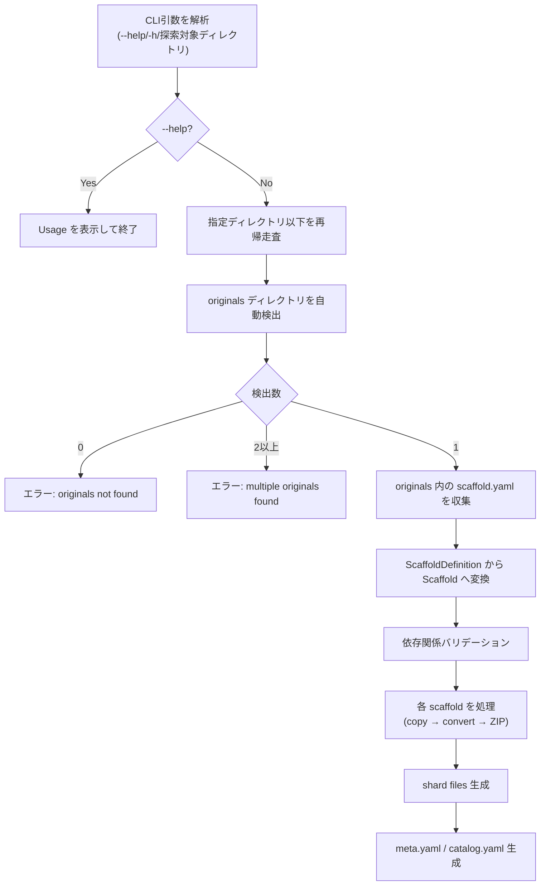

# Templatizer: 引数変更と originals 自動探索

## 背景 (Background)

現在の templatizer は、CLI 引数として `<base-dir>` を受け取り、その中の `catalog/originals` を固定パスで構築して scaffold.yaml を探索している。

```go
// main.go (現在)
baseDir := os.Args[1]
originalsDir := filepath.Join(baseDir, "catalog", "originals")
```

この設計には以下の問題がある：

1. **暗黙の規約依存**: `catalog/originals` というパスがコード内にハードコードされており、柔軟性がない
2. **仕様書との不整合**: 既存仕様書（`000-Templatizer-TempFolder.md`）のフローチャートには「CLI引数からcatalog.yamlパスを取得」と記載されているが、実際のコードは `<base-dir>` を受け取る実装になっており、混乱を招く
3. **実行時の不明確さ**: 引数が何を意味するか（プロジェクトルート？catalog ディレクトリ？）が Usage メッセージ (`Usage: templatizer <base-dir>`) だけでは判然としない

## 要件 (Requirements)

### 必須要件

1. **引数を「探索対象ディレクトリ」に変更する**
   - CLI 引数は、originals ディレクトリを含むルートディレクトリ（探索の起点）を指定する
   - Usage メッセージを明確に更新する（例: `Usage: templatizer <search-root-dir>`）

2. **originals ディレクトリの自動探索**
   - 指定されたディレクトリ以下を再帰的に走査し、`originals` ディレクトリを自動検出する
   - 検出条件: ディレクトリ名が `originals` であること
   - **複数の `originals` ディレクトリが見つかった場合はエラーとする**
     - エラーメッセージには、見つかった全 `originals` ディレクトリのパスを列挙する
     - ユーザーがより具体的なディレクトリを指定して再実行できるようにする

3. **originals 配下の scaffold.yaml 探索**
   - 検出された各 `originals` ディレクトリ内を再帰的に走査し、`scaffold.yaml` を発見する
   - 既存の `ScanScaffoldDefinitions` 関数を活用・拡張する

4. **`--help` オプションの追加**
   - `templatizer --help` または `templatizer -h` で使用方法を表示する
   - 表示内容: コマンドの説明、引数の説明、使用例

5. **catalog.yaml の入力引数としての廃止**
   - templatizer は `catalog.yaml` を入力として要求しない
   - `catalog.yaml` は templatizer の**出力**（インデックスファイル）であり、入力ではない

6. **出力先の決定ロジック**
   - 出力先（shard files, meta.yaml, catalog.yaml）は、検出された `originals` ディレクトリの親ディレクトリを基準とする
   - 例: `project/catalog/originals/` が見つかった場合 → 出力先は `project/catalog/`

7. **後方互換性**
   - 既存の scaffold.yaml フォーマットは変更しない
   - 出力される catalog 構造（shard files, meta.yaml, catalog.yaml）のフォーマットは変更しない

### 任意要件

- 探索時のログ出力（発見した originals ディレクトリのパスを表示）
- `--dry-run` オプションの追加（将来的に：探索結果のみ表示し、処理は実行しない）

## 実現方針 (Implementation Approach)

### 処理フロー変更



### 現在の処理フローとの比較

| 項目 | 現在 | 変更後 |
|---|---|---|
| CLI 引数 | `<base-dir>`（暗黙的に catalog の親） | `<search-root-dir>`（探索の起点） |
| originals の発見 | `baseDir + "catalog/originals"` 固定 | 再帰走査で自動検出 |
| scaffold.yaml の探索 | `ScanScaffoldDefinitions(originalsDir)` | 各 originals に対して `ScanScaffoldDefinitions` を実行 |
| 出力先の決定 | `baseDir` 固定 | originals の親ディレクトリ（`originals` を含む `catalog` 相当）を基準 |

### コード変更箇所

#### `main.go` の変更

```go
// 変更前
baseDir := os.Args[1]
originalsDir := filepath.Join(baseDir, "catalog", "originals")
defs, err := catalog.ScanScaffoldDefinitions(originalsDir)

// 変更後
// 1. 引数解析（--help / -h / 探索ディレクトリ）
searchRoot := parseArgs(os.Args[1:])

// 2. originals を自動探索 (2つ以上見つかったらエラー)
result, err := catalog.DiscoverOriginals(searchRoot)
// result には { originalsDir, baseDir (出力先), defs } が含まれる
```

#### `internal/catalog/` の変更

- **新規関数**: `DiscoverOriginals(searchRoot string) (*DiscoveryResult, error)`
  - 指定ディレクトリ以下を `filepath.WalkDir` で走査
  - ディレクトリ名が `originals` のエントリを収集
  - **0件の場合**: エラーを返す（`no originals directory found`）
  - **2件以上の場合**: エラーを返す（見つかった全パスを列挙）
  - **1件の場合**: その originals に対して `ScanScaffoldDefinitions` を実行し結果を返す
  - 出力先ディレクトリは originals の親ディレクトリとして決定

```go
// DiscoveryResult represents a discovered originals directory and its scaffolds.
type DiscoveryResult struct {
    OriginalsDir string               // path to the originals/ directory
    BaseDir      string               // parent of originals/ (output target)
    Definitions  []ScaffoldDefinition // scaffolds found in this originals/
}
```

### 既存コンポーネントへの影響

| コンポーネント | 変更有無 | 内容 |
|---|---|---|
| `main.go` | **変更** | 引数処理・フロー変更 |
| `internal/catalog/` | **変更** | `DiscoverOriginals` 関数の追加 |
| `internal/archiver/` | 変更なし | ZIP 圧縮ロジックはそのまま |
| `internal/copier/` | 変更なし | コピーロジックはそのまま |
| `internal/converter/` | 変更なし | テンプレート変換ロジックはそのまま |

## 検証シナリオ (Verification Scenarios)

1. **正常系: originals の自動検出と処理**
   (1) `templatizer .` を実行する（プロジェクトルートで）
   (2) `catalog/originals` ディレクトリが1つだけ検出される
   (3) 配下の scaffold.yaml が正しく読み込まれる
   (4) テンプレート変換・ZIP圧縮・shard生成が正常に完了する

2. **`--help` オプション**
   (1) `templatizer --help` を実行
   (2) 使用方法、引数の説明、使用例が表示される
   (3) `templatizer -h` でも同様に表示される

3. **引数なし**
   (1) `templatizer` を引数なしで実行
   (2) Usage メッセージが表示される

4. **エラー: originals が見つからない**
   (1) originals を含まないディレクトリを指定して実行
   (2) 「no originals directory found」等のエラーメッセージが表示される

5. **エラー: originals が2つ以上見つかった**
   (1) 同一ツリー内に2つの originals ディレクトリがある状態で実行
   (2) 「multiple originals directories found」のエラーメッセージが表示される
   (3) 見つかった各パスがエラーメッセージに列挙される

6. **既存の出力フォーマットの維持**
   (1) テンプレート変換後の ZIP ファイルの内容が変更前と同一であること
   (2) shard files, meta.yaml, catalog.yaml の構造が変更前と同一であること

## テスト項目 (Testing for the Requirements)

### 単体テスト

| テスト対象 | テスト内容 | テストファイル |
|---|---|---|
| `DiscoverOriginals` | 再帰走査で originals を1つ正しく検出すること | `internal/catalog/catalog_test.go` |
| `DiscoverOriginals` | originals が見つからない場合にエラーを返すこと | `internal/catalog/catalog_test.go` |
| `DiscoverOriginals` | originals が2つ以上見つかった場合にエラーを返すこと | `internal/catalog/catalog_test.go` |
| `parseArgs` | `--help` / `-h` で help フラグが立つこと | `main_test.go` または `main.go` 内 |
| 既存テスト | `ScanScaffoldDefinitions` のリグレッション確認 | `internal/catalog/catalog_test.go` |

### 検証コマンド

```bash
# 全体ビルド・単体テスト
scripts/process/build.sh

# templatizer 単体テストのみ
cd features/templatizer && go test ./...
```
