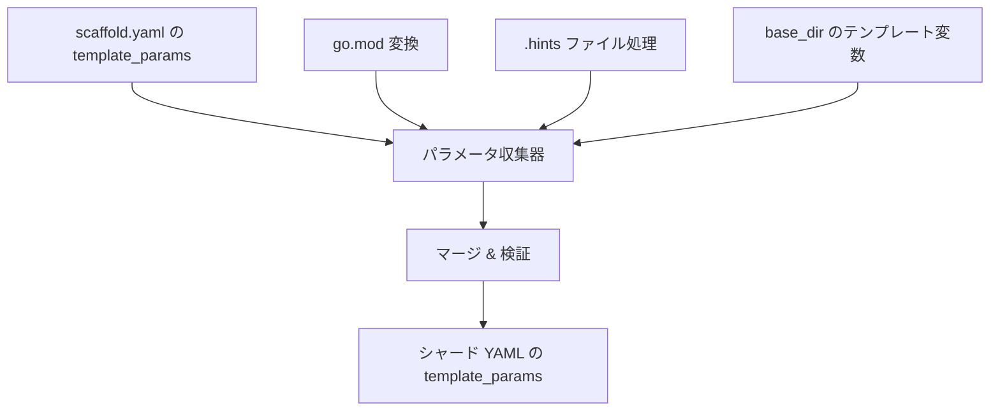

# 009: テンプレートパラメータの統一と自動蓄積

## 背景 (Background)

現在の templatizer には、テンプレートパラメータの管理に関して2つの問題がある。

### 問題1: パラメータ名の不統一

`scaffold.yaml` の `placement.base_dir` では `{{feature_name}}` を使用しているが、`template_params` では `program_name` を定義している。`go.mod` のテンプレート化（008 で修正）でも `{{program_name}}` を使用している。

```yaml
# scaffold.yaml の現状
placement:
  base_dir: "features/{{feature_name}}"  # ← feature_name を使用
template_params:
  - name: "module_path"    # ← module_path は定義済み
  - name: "program_name"   # ← ここは feature_name であるべき
```

`go.mod.tmpl` に生成されるテンプレート:
```
module {{module_path}}/{{program_name}}  ← program_name ではなく feature_name であるべき
```

### 問題2: テンプレートパラメータの手動管理

templatizer の変換パイプラインでは、各ステップで `{{module_path}}`, `{{feature_name}}` などのテンプレート変数が使用されるが、最終的にシャードYAML (`l.yaml`) に書き出される `template_params` は、元の `scaffold.yaml` から単にコピーされたものであり、変換中に実際に使用されたパラメータとの整合性確認や自動収集は行われない。

例えば `base_dir: "features/{{feature_name}}"` に含まれる `feature_name` は、`template_params` に手動で定義しなければシャードYAMLに反映されない。

## 要件 (Requirements)

### 必須要件

1. **`program_name` → `feature_name` への統一**: `scaffold.yaml` の `template_params` で使用している `program_name` を `feature_name` に変更し、`base_dir` の `{{feature_name}}` と一致させる。これに伴い、コード内の `program_name` 参照も `feature_name` に更新する。

2. **テンプレートパラメータの自動蓄積**: templatizer の変換パイプライン中に発見された全テンプレート変数を蓄積する仕組みを導入する。蓄積対象:
   - `go.mod` 変換で使用した `{{module_path}}`, `{{feature_name}}`
   - `base_dir` に含まれる `{{feature_name}}`
   - `.hints` ファイルの `replace_with` に含まれる `{{xxx}}` 形式のプレースホルダー
   - `.tmpl` ファイル（変換後）に含まれるテンプレート変数

3. **シャードYAMLへの反映**: 蓄積されたパラメータを最終的にシャードYAML（例: `l.yaml`）の `template_params` に反映する。`scaffold.yaml` に定義された `template_params` の情報（description, required, default 等）と、変換で発見されたパラメータをマージする。
   - `scaffold.yaml` で定義済みのパラメータ: そのまま使用
   - 変換中に発見されたが `scaffold.yaml` に未定義のパラメータ: 警告を出力し、`template_params` に自動追加（description は空、required=true）

### 任意要件

- 変換中に発見されたパラメータと `scaffold.yaml` の `template_params` の不一致をレポートする機能（未定義パラメータの検出）

## 実現方針 (Implementation Approach)

### 変更概要



### 主要な変更点

1. **`scaffold.yaml` 修正**: 全 originals の `scaffold.yaml` で `program_name` → `feature_name` に変更

2. **`converter.go` 修正**: 
   - `BuildConvertParams` での `program_name` → `feature_name` 対応
   - `NewModule` のテンプレート形式: `{{module_path}}/{{feature_name}}`

3. **パラメータ収集機構の新設**: 
   - 変換パイプラインの各ステップでテンプレート変数を収集する `ParamCollector` を導入
   - `Convert` 関数に `ParamCollector` を追加し、変換後に収集結果を返す

4. **`main.go` 修正**: 
   - `processScaffold` で `ParamCollector` の結果を取得
   - `generateShardFiles` で蓄積されたパラメータを `template_params` にマージ

5. **テスト更新**: `program_name` → `feature_name` の変更を全テストに反映

## 検証シナリオ (Verification Scenarios)

1. templatizer を実行する
2. 生成されたシャードYAML (`l.yaml`) の `template_params` を確認
3. `feature_name` パラメータが存在し、`program_name` が存在しないこと
4. `base_dir` の `{{feature_name}}` に対応するパラメータが `template_params` に含まれること
5. 生成されたZIPを展開し、`go.mod.tmpl` に `module {{module_path}}/{{feature_name}}` が含まれること

## テスト項目 (Testing for the Requirements)

### 要件1: `program_name` → `feature_name` 統一

| 要件 | テストケース |
| :--- | :--- |
| `TransformGoMod` が `{{feature_name}}` を使用 | `TestTransformGoMod` の更新 |
| `BuildConvertParams` が `feature_name` を認識 | `TestBuildConvertParamsOldValueFallback` の更新 |
| `Convert` パイプラインが `feature_name` で動作 | `TestConvert` の更新 |

### 要件2-3: テンプレートパラメータ自動蓄積

| 要件 | テストケース |
| :--- | :--- |
| パラメータ収集器が変数を正しく収集 | `TestParamCollector` (新規) |
| scaffold.yaml 定義と収集結果のマージ | `TestMergeTemplateParams` (新規) |
| 未定義パラメータの検出 | `TestParamCollector` 内のサブテスト |

### 検証コマンド

```bash
# ビルドとユニットテスト
./scripts/process/build.sh

# 統合テスト
./scripts/process/integration_test.sh
```
