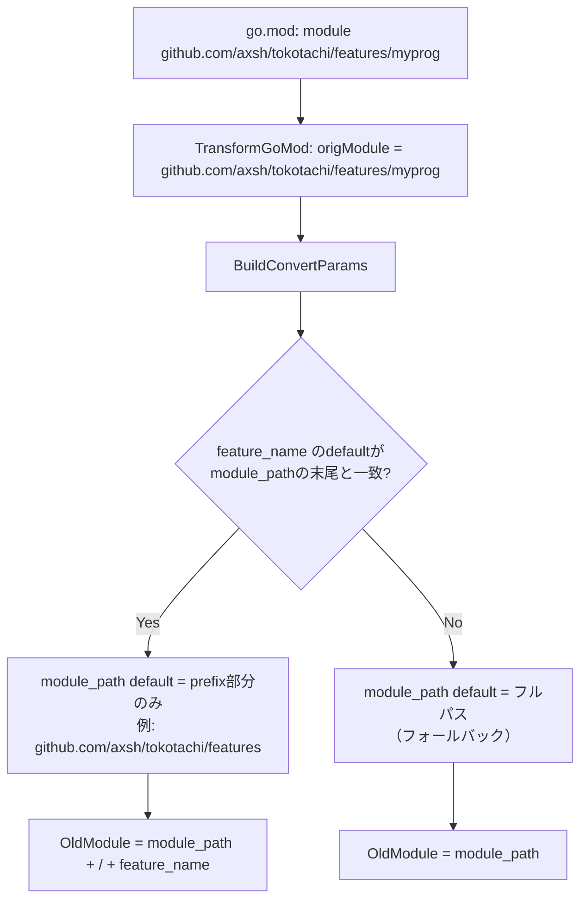

# go.mod パース時の module_path / feature_name 分離

## 背景 (Background)

templatizer がオリジナルプロジェクトの `go.mod` をパースしてテンプレート化する際、`module` 行のフルパスをそのまま `module_path` の `default` 値として設定している。

例えば、元の `go.mod` が以下の場合:

```
module github.com/axsh/tokotachi/features/myprog
```

そして `feature_name` が `myprog`（フォルダ名と一致）の場合、現在の出力:

```yaml
template_params:
  - name: "module_path"
    default: "github.com/axsh/tokotachi/features/myprog"  # ← feature_name を含んでいる
  - name: "feature_name"
    default: "myprog"
```

しかし、テンプレート化された `go.mod.tmpl` は:

```
module {{module_path}}/{{feature_name}}
```

であるため、`module_path` と `feature_name` が結合されるとモジュールパスが `github.com/axsh/tokotachi/features/myprog/myprog` になってしまう（重複）。

### 正しい出力

```yaml
template_params:
  - name: "module_path"
    default: "github.com/axsh/tokotachi/features"  # ← feature_name を除外
  - name: "feature_name"
    default: "myprog"
```

## 要件 (Requirements)

### 必須要件

1. **go.mod module 行のパース改善**: go.mod の `module` 行から取得したフルパスを、`module_path` と `feature_name` に正しく分離する
   - `feature_name` の値（= フォルダ名）がモジュールパスの末尾セグメントと一致する場合:
     - `module_path` default = フルパスから末尾の `feature_name` セグメントを除いた部分
     - `feature_name` default = フォルダ名（現状通り）
   - 一致しない場合: フォールバックとして現行動作を維持

2. **scaffold.yaml の `template_params` 出力修正**: 生成される `scaffold.yaml` の `module_path` の `default` 値に `feature_name` が含まれないようにする

3. **既存テストの更新**: 修正に伴い、`module_path` の default 値を検証している既存テストの期待値を更新する

### 任意要件

- 分離ロジックは `go.mod` パース時点ではなく、`scaffold.yaml` の `template_params` の `default` 値を計算する時点で行うことが望ましい（パース自体はフルパスを返すまま維持）

## 実現方針 (Implementation Approach)

### 修正対象ファイル

1. **`features/templatizer/internal/converter/converter.go`** の `BuildConvertParams` 関数
   - `module_path` の `default`/`OldValue` から末尾の `feature_name` セグメントを除外するロジックを追加
   - 具体的には: `module_path` が `<prefix>/<feature_name>` の形式の場合、`OldModule` を `<prefix>` に変更

2. **元の `scaffold.yaml`** (`catalog/originals/axsh/go-standard-feature/scaffold.yaml`)
   - `module_path` の `default` を `github.com/axsh/tokotachi/features` に修正

3. **テストファイルの更新**
   - `converter_test.go`: `BuildConvertParams` テストの期待値を更新
   - `param_collector_test.go`: 必要に応じてテストデータを更新

### 処理フロー



## 検証シナリオ (Verification Scenarios)

1. scaffold.yaml に `module_path` default: `github.com/axsh/tokotachi/features/myprog` と `feature_name` default: `myprog` が定義されている場合
   - `BuildConvertParams` が `OldModule` = `github.com/axsh/tokotachi/features/myprog` を返す
   - `HintParams["module_path"]` = `github.com/axsh/tokotachi/features` になる（末尾の `myprog` を除外）
2. `feature_name` がモジュールパスの末尾と一致しない場合、`module_path` はフルパスのまま維持される
3. `feature_name` が存在しない場合、現行動作と同じ（`module_path` = フルパス）

## テスト項目 (Testing for the Requirements)

### 自動テスト

| 要件 | テスト | 検証コマンド |
|------|--------|-------------|
| module_path/feature_name 分離 | `TestBuildConvertParamsOldValueFallback` の更新・追記 | `scripts/process/build.sh` |
| フォールバック動作 | `TestBuildConvertParamsOldValueFallback` 内の既存ケース維持 | `scripts/process/build.sh` |
| 全体パイプライン | `TestConvert` の既存テスト | `scripts/process/build.sh` |

### 検証コマンド

```bash
# 全体ビルド・単体テスト
scripts/process/build.sh

# converter パッケージのみ
cd features/templatizer && go test -v -count=1 ./internal/converter/...
```
