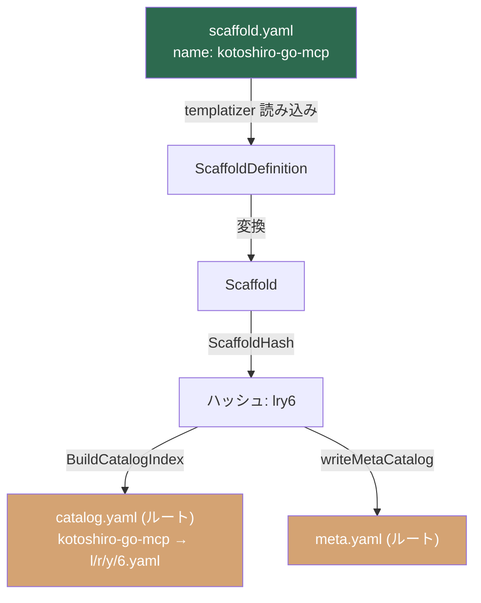

# カタログ名の不一致修正 (Catalog Name Mismatch Fix)

## 背景 (Background)

tokotachi-scaffolds リポジトリにおいて、**ルートの `catalog.yaml`（インデックスファイル）と `catalog/catalog.yaml`（templatizer生成のインデックス）との間で、scaffold の名前が不一致になっている**問題が発生している。

### 現在の状態

| ファイル | スキャフォールド名 | シャードパス | 存在 |
|---|---|---|---|
| ルート `catalog.yaml` | `axsh-go-kotoshiro-mcp` | `i/4/2/h.yaml` | ❌ 存在しない |
| `catalog/catalog.yaml` | `kotoshiro-go-mcp` | `l/r/y/6.yaml` | ✅ 存在する |
| `catalog/originals/.../scaffold.yaml` | `kotoshiro-go-mcp` | - | ✅ 正の情報源 |
| シャードファイル `l/r/y/6.yaml` | `kotoshiro-go-mcp` | - | ✅ 正しい |

### 影響

- **`List()` API**: ルートの `catalog.yaml` を読むため、`axsh-go-kotoshiro-mcp` → `i/4/2/h.yaml` をフェッチしようとし、**ファイルが見つからない**。
- **`Run()` API**: `ShardPath("feature", "kotoshiro-go-mcp")` で `l/r/y/6.yaml` を直接読むため、**こちらは正しく動作する**。
- `List()` と `Run()` で参照する名前が異なるため、一貫性が壊れている。

### 根本原因

ルートの `catalog.yaml` は templatizer 以前に手動で作成された古いファイルであり、scaffold.yaml の `name` フィールドとは異なる名前（`axsh-go-kotoshiro-mcp`）が使われていた。templatizer はこのファイルを更新せず、`catalog/catalog.yaml` に正しいインデックスを生成するため、2つの catalog.yaml が並存している状態。

## 要件 (Requirements)

### 必須要件

1. **ルートの `catalog.yaml` と `meta.yaml` を templatizer で正しく生成する**  
   - templatizer のカタログインデックス・メタ情報の出力先を、`catalog/` 配下から**ルートディレクトリのみに出力する**よう変更する。
   - `catalog/catalog.yaml` と `catalog/meta.yaml` は廃止する。
   - ルートの `catalog.yaml` は scaffold.yaml の `name` フィールドに基づいた正しい名前・シャードパスを反映する。

2. **scaffold.yaml の `name` フィールドを正の情報源とする**  
   - [scaffold.yaml](file://catalog/originals/axsh/go-kotoshiro-mcp-feature/scaffold.yaml) の `name: "kotoshiro-go-mcp"` がすべての場所で使われるように統一する。

3. **テストコードの修正**  
   - [catalog_test.go](file://features/templatizer/internal/catalog/catalog_test.go) 内で `axsh-go-kotoshiro-mcp` を使用しているテストケースを `kotoshiro-go-mcp` に修正する。

4. **templatizer のメタ・インデックス出力先をルートに変更する**  
   - 現在 `writeCatalogIndex` は `baseDir`（= `catalog/`）に `catalog.yaml` を出力し、`writeMetaCatalog` も同様に `catalog/meta.yaml` を出力している。
   - 出力先を `baseDir` から **`repoRoot`（ルートディレクトリ）に変更**し、`catalog/catalog.yaml` と `catalog/meta.yaml` への出力を廃止する。

### 任意要件

- templatizer 実行時に旧 `catalog.yaml`（ルート）の存在を検知し、警告を出す仕組みの追加。

## 実現方針 (Implementation Approach)

### 方針: templatizer の出力先をルートに変更する

templatizer の `main.go` では `writeCatalogIndex(baseDir, index)` により `catalog/catalog.yaml` を生成している。出力先を `baseDir` から `repoRoot` に変更し、**ルートディレクトリのみに `catalog.yaml` と `meta.yaml` を出力する**ようにする。`catalog/catalog.yaml` と `catalog/meta.yaml` は廃止する。



### 変更ファイル

1. **`features/templatizer/main.go`**: `writeCatalogIndex` と `writeMetaCatalog` の出力先を `baseDir` から `repoRoot` に変更。
2. **`features/templatizer/internal/catalog/catalog_test.go`**: テストケース内の `axsh-go-kotoshiro-mcp` を `kotoshiro-go-mcp` に修正。
3. **`catalog/catalog.yaml`**: 廃止（削除）。
4. **`catalog/meta.yaml`**: 廃止（削除）。
5. **`catalog.yaml`（ルート）**: templatizer で自動生成され、正しい名前 `kotoshiro-go-mcp` を反映。

## 検証シナリオ (Verification Scenarios)

1. templatizer を実行して、ルート `catalog.yaml` と `meta.yaml` が正しく生成されることを確認する
2. `catalog/catalog.yaml` と `catalog/meta.yaml` が生成されないことを確認する
3. ルート `catalog.yaml` で、`feature` カテゴリ下に `kotoshiro-go-mcp` → `catalog/scaffolds/l/r/y/6.yaml` のマッピングが存在することを確認する
4. `axsh-go-kotoshiro-mcp` という名前がどの `catalog.yaml` にも存在しないことを確認する
5. シャードファイル `l/r/y/6.yaml` が実際に存在し、内部の `name` が `kotoshiro-go-mcp` であることを確認する

## テスト項目 (Testing for the Requirements)

### 自動テスト

1. **単体テスト**: テストコード修正後、以下を実行して全テストが通ることを確認
   ```bash
   scripts/process/build.sh
   ```

2. **統合テスト**: templatizer を実行し、生成されたカタログの一貫性を検証
   ```bash
   scripts/process/integration_test.sh
   ```

### 手動検証

- templatizer 実行後、ルート `catalog.yaml` が正しく生成され、`catalog/catalog.yaml` が存在しないことを目視確認
