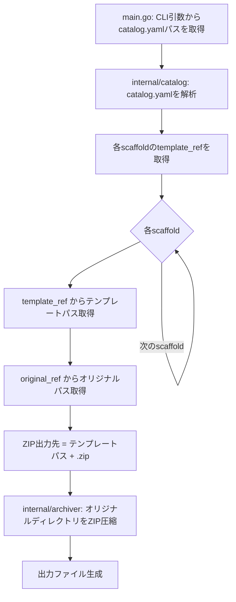

# Templatizer: オリジナルディレクトリの ZIP 圧縮ツール

## 背景 (Background)

tokotachi-scaffolds プロジェクトでは、各 scaffold のテンプレートは以下の2箇所で管理されている:

- **`catalog/originals/`**: 元のファイル群（生のディレクトリ構造）
- **`catalog/templates/`**: テンプレート化されたファイル群（プレースホルダー置換などの加工済み）

`catalog.yaml` が各 scaffold の `template_ref` フィールドでテンプレートパスを定義しており、これが scaffold の管理単位となっている。

現状、`features/templatizer` は Go の Hello World スケルトンのみで、実際の機能は未実装である。このツールを、**オリジナルディレクトリを ZIP 圧縮して配布可能な形式にする**ユーティリティとして実装したい。

## 要件 (Requirements)

### 必須要件

1. **catalog.yaml の解析**
   - `catalog.yaml` を読み込み、全 scaffold エントリの `template_ref` フィールドを取得する
   - 例: `catalog/templates/root/project-default`, `catalog/templates/axsh/go-standard-project`, `catalog/templates/axsh/go-standard-feature`

2. **パスの取得**
   - **テンプレートパス**: `template_ref` の値そのもの（例: `catalog/templates/axsh/go-standard-project`）
   - **オリジナルパス**: `original_ref` の値そのもの（例: `catalog/originals/axsh/go-standard-project`）
   - プログラム側でのパス変換・読み替えは一切不要

3. **ZIP 圧縮**
   - テンプレートパスの末尾に `.zip` を付与したものを出力ファイル名とする
   - 例: `catalog/templates/axsh/go-standard-project` → 出力ファイル: `catalog/templates/axsh/go-standard-project.zip`
   - オリジナルパスのディレクトリ内容を ZIP 圧縮し、上記の出力ファイルとして生成する

4. **CLI インターフェース**
   - `features/templatizer` ディレクトリ内の Go プログラムとして実装
   - コマンドライン引数で `catalog.yaml` のパスを指定できること
   - すべての scaffold を一括処理すること

### 任意要件

- 処理の進捗ログを標準出力に表示する
- 既存の ZIP ファイルがある場合は上書きする
- エラー時に適切なエラーメッセージを表示して exit code 1 で終了する

## 実現方針 (Implementation Approach)

### アーキテクチャ

```
features/templatizer/
├── main.go                        # エントリポイント（CLI引数処理、メイン制御）
├── go.mod
└── internal/
    ├── catalog/
    │   ├── catalog.go             # catalog.yaml の解析ロジック・パス導出
    │   └── catalog_test.go        # catalog 解析のテスト
    └── archiver/
        ├── archiver.go            # ZIP 圧縮ロジック
        └── archiver_test.go       # ZIP 圧縮のテスト
```

### 処理フロー



### 主要コンポーネント

1. **`internal/catalog/catalog.go`**: `gopkg.in/yaml.v3` を使用して `catalog.yaml` を解析し、各 scaffold の `template_ref` と `original_ref` を抽出する構造体とパーサー
2. **`internal/archiver/archiver.go`**: `archive/zip` 標準ライブラリを使用して、指定ディレクトリを再帰的に ZIP 圧縮する関数
3. **`main.go`**: CLI 引数処理、各 scaffold に対する ZIP 生成のオーケストレーション

### パス解決の詳細

`catalog.yaml` がプロジェクトルートにある前提で、`template_ref` はプロジェクトルートからの相対パス:

| scaffold | template_ref | original_ref | ZIP 出力ファイル |
|---|---|---|---|
| default | `catalog/templates/root/project-default` | `catalog/originals/root/project-default` | `catalog/templates/root/project-default.zip` |
| axsh-go-standard (project) | `catalog/templates/axsh/go-standard-project` | `catalog/originals/axsh/go-standard-project` | `catalog/templates/axsh/go-standard-project.zip` |
| axsh-go-standard (feature) | `catalog/templates/axsh/go-standard-feature` | `catalog/originals/axsh/go-standard-feature` | `catalog/templates/axsh/go-standard-feature.zip` |

## 検証シナリオ (Verification Scenarios)

1. `catalog.yaml` を読み込み、3つの scaffold の `template_ref` と `original_ref` を正しく取得できること
2. 各 scaffold に対し、`original_ref` のディレクトリを ZIP 圧縮して `template_ref + .zip` のファイルとして生成できること
3. `catalog/originals/root/project-default` ディレクトリを ZIP 圧縮して `catalog/templates/root/project-default.zip` を生成できること
4. 生成された ZIP ファイルを展開すると、元のオリジナルディレクトリと同じ内容であること
5. 全 scaffold に対して一括で ZIP ファイルが生成されること
6. 存在しないオリジナルディレクトリが指定された場合、エラーメッセージが表示されること

## テスト項目 (Testing for the Requirements)

### 単体テスト

| テスト対象 | テスト内容 | テストファイル |
|---|---|---|
| catalog.yaml 解析 | YAML を解析し `template_ref` と `original_ref` のリストを正しく返すこと | `internal/catalog/catalog_test.go` |
| ZIP 圧縮 | ディレクトリを ZIP 化し、展開結果が元と一致すること | `internal/archiver/archiver_test.go` |
| エラーハンドリング | 存在しないディレクトリの指定時にエラーを返すこと | `internal/archiver/archiver_test.go` |

### 検証コマンド

```bash
# 全体ビルド・単体テスト
scripts/process/build.sh

# templatizer 単体テストのみ
cd features/templatizer && go test ./...
```
